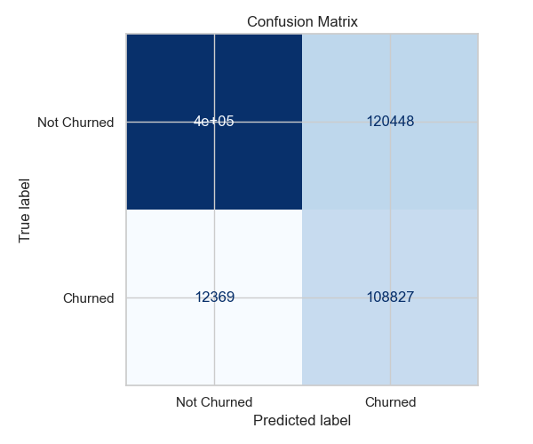
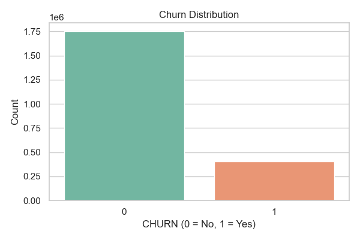
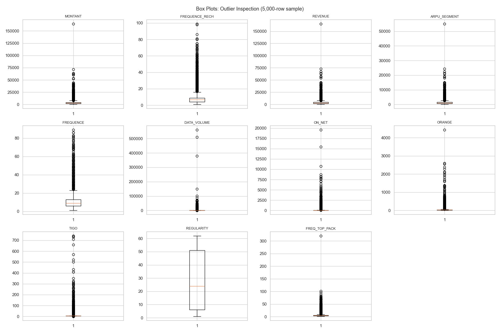
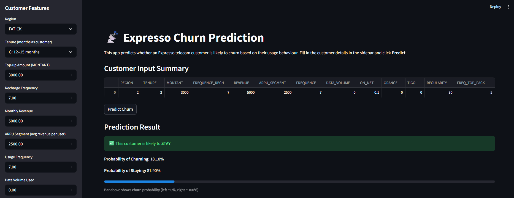

# Expresso Churn Prediction

## Project Overview

This project builds a machine learning model to predict whether an Expresso telecom customer will churn, meaning the customer is likely to stop using the service.

The project was originally completed as part of my **GoMyCode Data Science Programme checkpoints back in 2023** and later refined as part of my data science portfolio.

A **Streamlit web application** is included, allowing users to enter customer details and receive a real-time churn prediction.

---

## Table of Contents

* [Project Overview](#project-overview)
* [Dataset Description](#dataset-description)
* [Project Objective](#project-objective)
* [Project Workflow](#project-workflow)
* [Data Preprocessing](#data-preprocessing)
* [Modelling](#modelling)
* [Model Evaluation](#model-evaluation)
* [Visualisations and Screenshots](#visualisations-and-screenshots)
* [Streamlit App](#streamlit-app)
* [Repository Structure](#repository-structure)
* [How to Run the Project](#how-to-run-the-project)
* [Requirements](#requirements)
* [Future Improvements](#future-improvements)
* [Conclusion](#conclusion)
* [Author](#author)

---

## Dataset Description

The dataset is from the **Expresso Churn Prediction Challenge** hosted on Zindi Africa.

Expresso is a telecommunications company operating in Mauritania and Senegal. The dataset describes approximately 2.15 million customers with behavioural and usage features collected over a six-month period.

| Item           | Detail                               |
| -------------- | ------------------------------------ |
| Rows           | Approximately 2.15 million customers |
| Columns        | 19                                   |
| Target         | `CHURN`                              |
| Target Meaning | `0 = stayed`, `1 = churned`          |
| Churn Rate     | Approximately 18.8%                  |

The dataset is not included in this repository. See [`data/README.md`](data/README.md) for download instructions.

---

## Project Objective

The goal of this project is to predict customer churn using telecom customer behaviour data.

Specific objectives:

* Explore and understand the dataset
* Handle missing values, duplicates, and outliers
* Encode categorical features
* Scale numerical features
* Address class imbalance
* Train and evaluate a classification model
* Deploy the model as an interactive Streamlit application

---

## Project Workflow

1. Load and explore the dataset
2. Identify and handle missing values using median and mode imputation
3. Drop columns with limited predictive value: `user_id`, `MRG`, `ZONE1`, `ZONE2`, and `TOP_PACK`
4. Encode `REGION` using Label Encoding
5. Encode `TENURE` using Ordinal Encoding
6. Handle outliers using the IQR method
7. Split the dataset into training and test sets
8. Scale the feature columns using `MinMaxScaler`
9. Train a Logistic Regression model with `class_weight='balanced'`
10. Evaluate the model using accuracy, ROC-AUC, confusion matrix, and classification report
11. Save the model, scaler, and region encoder as pickle files
12. Load the saved files in the Streamlit app for real-time predictions

---

## Data Preprocessing

### Columns Dropped

| Column     | Reason                                                        |
| ---------- | ------------------------------------------------------------- |
| `user_id`  | Customer identifier, not a useful predictive feature          |
| `MRG`      | Contains only one unique value, so it has no predictive power |
| `ZONE1`    | High percentage of missing values                             |
| `ZONE2`    | High percentage of missing values                             |
| `TOP_PACK` | High-cardinality categorical feature                          |

### Missing Value Strategy

Numeric columns were filled using the **median** because median is more robust to skewed values and outliers.

Categorical columns were filled using the **mode**, which represents the most frequent category.

### Encoding

* `REGION` was encoded using Label Encoding.
* `TENURE` was encoded using Ordinal Encoding because the tenure bands have a natural order.

### Class Imbalance

The dataset is imbalanced because only a minority of customers churned.

To address this, the Logistic Regression model used:

```python
class_weight="balanced"
```

This gives more weight to the minority churn class during training.

---

## Modelling

| Item             | Detail                    |
| ---------------- | ------------------------- |
| Algorithm        | Logistic Regression       |
| Solver           | `liblinear`               |
| Class Weight     | `balanced`                |
| Train/Test Split | 70% training, 30% testing |

Logistic Regression was selected because it is simple, interpretable, and suitable as a baseline model for churn prediction.

---

## Model Evaluation

The model was evaluated using:

* Accuracy
* ROC-AUC Score
* Confusion Matrix
* Classification Report
* Precision
* Recall
* F1-score

Accuracy alone is not enough for an imbalanced churn dataset. Recall is especially important because the business wants to identify as many likely churners as possible.



---

## Visualisations and Screenshots

This section shows the key visual outputs generated during the project, including data exploration, model evaluation, and the Streamlit application interface.

---

### Churn Distribution

This chart shows the distribution of customers who stayed versus customers who churned. It helps show the class imbalance in the dataset.



---

### Outlier Analysis

This visualisation shows the distribution of selected numerical features and helps identify potential outliers in the customer behaviour data.



---

## Streamlit App

The Streamlit app loads the trained model, scaler, and region encoder. It allows users to:

* Select a customer region
* Select a customer tenure band
* Enter customer behaviour values such as revenue, recharge frequency, data usage, and regularity
* Click **Predict Churn**
* View the churn prediction and probability score

### Streamlit App Demo



---

## Repository Structure

```text
expresso-churn-prediction/
│
├── data/
│   └── README.md
│
├── notebooks/
│   └── expresso_churn_prediction.ipynb
│
├── images/
│   ├── churn_distribution.png
│   ├── boxplots.png
│   ├── confusion_matrix.png
│   └── streamlit_app_demo.png
│
├── app.py
├── README.md
├── requirements.txt
└── .gitignore
```

> **Note:** `model.pkl`, `scaler.pkl`, and `region_encoder.pkl` are generated locally when the notebook is run. They are excluded from the repository using `.gitignore`.

---

## How to Run the Project

### 1. Clone the repository

```bash
git clone https://github.com/yourusername/expresso-churn-prediction.git
cd expresso-churn-prediction
```

### 2. Install dependencies

For Windows:

```bash
py -m pip install -r requirements.txt
```

Alternative:

```bash
pip install -r requirements.txt
```

### 3. Download the dataset

Follow the instructions in [`data/README.md`](data/README.md) and place the CSV file inside the `data/` folder.

### 4. Run the notebook

Open and run all cells in:

```text
notebooks/expresso_churn_prediction.ipynb
```

This will train the model and generate:

```text
model.pkl
scaler.pkl
region_encoder.pkl
```

### 5. Launch the Streamlit app

For Windows:

```bash
py -m streamlit run app.py
```

Alternative:

```bash
streamlit run app.py
```

---

## Requirements

The project uses the following Python libraries:

```text
pandas
numpy
matplotlib
seaborn
scikit-learn
streamlit
```

Your `requirements.txt` file should contain:

```text
pandas
numpy
matplotlib
seaborn
scikit-learn
streamlit
```

---

## Future Improvements

Future improvements for this project include:

* Try more powerful classifiers such as Random Forest, XGBoost, or LightGBM
* Use One-Hot Encoding for categorical variables such as `REGION`
* Apply SMOTE as an alternative class imbalance handling method
* Add log transformation for highly skewed numerical columns
* Perform hyperparameter tuning with GridSearchCV
* Add feature importance visualisation
* Save preprocessing and model steps together using a Scikit-learn pipeline
* Deploy the Streamlit app to Streamlit Cloud for public access

---

## Conclusion

This project demonstrates how machine learning can be applied to a real-world telecom churn prediction problem.

Using Logistic Regression with balanced class weights, the model identifies customers who are likely to churn based on usage and behavioural patterns.

The project covers the full data science workflow, including data cleaning, feature engineering, model training, model evaluation, and deployment through a Streamlit web application.

---

## Author

**Victor Uzoewulu**

This project was originally completed as part of my **GoMyCode Data Science Programme checkpoints back in 2023** and later refined as part of my data science portfolio.
